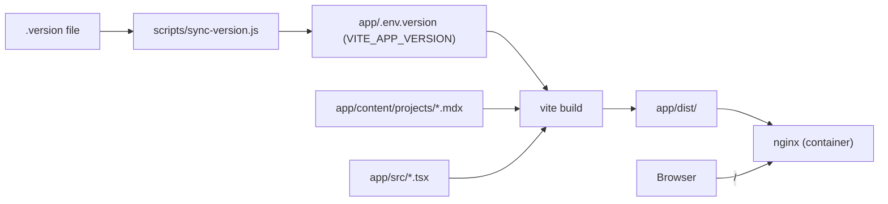

# CRA -> Vite + TypeScript migration

## Decisions locked

- **MDX**: option C - `@mdx-js/rollup`, build-time compile. Removes `scripts/sync-project-articles.js` entirely.
- **Backend prep**: none. Pure CRA -> Vite + TS refactor; Python backend is a separate task.

## Target tooling

- Vite 7 + `@vitejs/plugin-react`
- TypeScript 5 (`tsc --noEmit` for typecheck only)
- `@mdx-js/rollup` + `remark-frontmatter` + `remark-mdx-frontmatter` (kept), drops `@mdx-js/mdx` and `unified`/`remark-parse` (no longer needed at runtime or in build script)
- Vitest + jsdom + `@testing-library/react` (replaces Jest/`react-scripts test`)
- Output dir: `dist/` (Vite default)

## File-by-file changes in `app/`

### Config (new)

- `app/vite.config.ts` - React + MDX plugins, `build.outDir = 'dist'`.
- `app/tsconfig.json` - `strict: true`, `jsx: react-jsx`, `moduleResolution: bundler`, includes `src` and `content`.
- `app/tsconfig.node.json` - for `vite.config.ts`.
- `app/src/vite-env.d.ts` - Vite client types + an ambient `declare module '*.mdx'` exporting `default: ComponentType` and `frontmatter: ProjectFrontmatter`.
- `app/.env.example` - `VITE_APP_VERSION=`.

### `package.json` (rewrite)

- Remove `react-scripts`, `@testing-library/jest-dom` Jest matchers config, `eslintConfig`, `browserslist`.
- Add deps: `@mdx-js/rollup`, keep `@mdx-js/react` only if needed (likely not).
- Add devDeps: `vite`, `@vitejs/plugin-react`, `typescript`, `@types/react`, `@types/react-dom`, `@types/node`, `vitest`, `jsdom`, `@vitest/ui` (optional).
- Scripts:
  - `prestart`/`predev`/`prebuild`: `node ../scripts/sync-version.js` (sync-projects script is gone)
  - `dev`: `vite`
  - `build`: `tsc --noEmit && vite build`
  - `preview`: `vite preview`
  - `test`: `vitest`

### Source rename + types (`app/src/`)

- `index.js` -> `app/src/main.tsx`. Use `document.getElementById('root') as HTMLElement`. Drop `reportWebVitals` (CRA-only; web-vitals v2 API is deprecated; can be re-added later with v4 if you actually want metrics).
- `App.js` -> `app/src/App.tsx`. Add types for the sprite animation state, refs (`HTMLCanvasElement`, `HTMLDivElement`), event handlers, `themeMode: 'dark' | 'light' | 'auto'`. Replace `process.env.REACT_APP_VERSION` with `import.meta.env.VITE_APP_VERSION ?? '0.0.0'`.
- `ProjectsPage.js` -> `app/src/ProjectsPage.tsx`. Source projects from a new `projects.ts` registry (see below).
- `ProjectArticlePage.js` -> `app/src/ProjectArticlePage.tsx`. Big simplification - no more `useEffect`/`compile`/`run`. Body becomes:

```tsx
const article = getProjectBySlug(slug);
if (!article) return <NotFound />;
const { Component, frontmatter } = article;
return (
  <article className="projects-page">
    <h2 className="projects-title">{frontmatter.title}</h2>
    <p className="project-meta">{frontmatter.date}</p>
    <Component />
  </article>
);
```

- New `app/src/projects.ts` replaces `generatedProjects.js`:

```ts
type MdxModule = { default: ComponentType; frontmatter: ProjectFrontmatter };
const modules = import.meta.glob<MdxModule>('../content/projects/*.mdx', { eager: true });
export const allProjects = Object.entries(modules).map(([path, m]) => ({
  Component: m.default,
  frontmatter: m.frontmatter,
  slug: m.frontmatter.slug,
}));
export const publishedProjects = allProjects
  .filter(p => p.frontmatter.published)
  .sort((a, b) => b.frontmatter.date.localeCompare(a.frontmatter.date));
export const getProjectBySlug = (slug: string) =>
  publishedProjects.find(p => p.slug === slug) ?? null;
```

- Delete `app/src/generatedProjects.js` and `app/src/mdxRemarkPlugins.js` (the plugin list moves into `vite.config.ts`).
- `App.test.js` -> `app/src/App.test.tsx`. Update to a passing smoke test (the existing one looks for "dark mode" which doesn't exist in the current UI). Add `app/src/setupTests.ts` wired in `vite.config.ts` `test.setupFiles`.
- `setupTests.js` -> ported to `setupTests.ts`.
- `reportWebVitals.js` - deleted.
- Keep `app/src/App.css`, `app/src/index.css`, `app/src/logo.svg` as-is.

### `index.html` (move + edit)

- Move `app/public/index.html` -> `app/index.html` (Vite convention).
- Replace `%PUBLIC_URL%/...` with `/...`, drop CRA's template comments, add `<script type="module" src="/src/main.tsx"></script>` before `</body>`.
- Keep the Bootstrap + Bootstrap Icons CDN `<link>`s.

### Generated-version flow

- `scripts/sync-version.js`: change `outSourcePath` from `app/src/generatedVersion.js` to writing `app/.env.version` with `VITE_APP_VERSION=...`. Vite picks it up automatically (or we `dotenv` it in `vite.config.ts`). This keeps the `.version` -> UI badge flow working without a generated `.ts` file.
- Delete `app/src/generatedVersion.js` (already gitignored, currently unused per grep).
- Update `.gitignore`: remove the `generatedVersion.js`/`generatedProjects.js` lines, replace with `/app/.env.version` and `/app/dist`.

### Dockerfile

- `app/Dockerfile`:
  - Builder: `npm ci`, `COPY app .`, `npm run build` -> output now at `/workspace/app/dist`.
  - Final stage: `COPY --from=builder /workspace/app/dist /usr/share/nginx/html`.
  - Drop the React-Scripts-specific `test -x node_modules/.bin/react-scripts` check.
  - Build arg renamed: `VITE_APP_VERSION` (kept `REACT_APP_VERSION` accepted as fallback for back-compat in compose).
- `app/nginx.conf` - unchanged.

### docker-compose / makefile

- `docker-compose.yml`: pass `VITE_APP_VERSION` build arg (keep `REACT_APP_VERSION` too for one release of compatibility).
- `makefile.mak`: rename build arg in the `docker build` line; no other changes.

### Files that stay untouched

- `scripts/sync-version.js` (only the output path/format changes), `scripts/version-source.js`, `scripts/create-version-tag.js`, `scripts/git-release-tag.js`, `scripts/read-version.js`, `scripts/verify-head-version-tag.js`, all of `app/content/`, all of `app/public/static/`, `app/public/manifest.json`, `app/public/favicon.ico`, `app/public/robots.txt`.

## Migration data flow (after)



## What this buys you

- One toolchain, one config (`vite.config.ts`).
- Type safety across the app and across MDX frontmatter.
- Articles ship as pre-compiled components (no in-browser MDX compiler), no "Loading article..." flash.
- `app/src/generatedProjects.js` and the `sync-project-articles.js` script disappear; editing a `.mdx` hot-reloads instantly.

## Things you should know going in

- Output directory changes from `build/` to `dist/` - any external scripts/CI/docs referencing `app/build` need a one-line update. `deploy.md` doesn't reference it.
- `process.env.REACT_APP_*` -> `import.meta.env.VITE_*`. Anything outside `app/src/` setting `REACT_APP_VERSION` (Dockerfile arg, makefile, compose) gets renamed in this PR.
- Existing `App.test.js` is already stale (asserts a "dark mode" label that no longer exists) - the rewritten smoke test will assert real labels like "Open menu" / "Scale up animation".
- Node 20 in `app/Dockerfile` is fine for Vite 7 (requires Node >=20.19).
